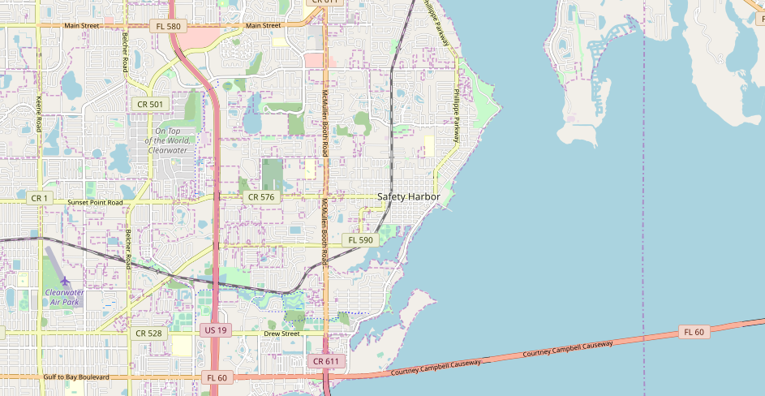

#Project: Wrangle Open Street Map data

##Project Overview:  
The challenge is to choose any area of the world in https://www.openstreetmap.org
 Download the chosen map's OSM XML data,  assess the quality of the data for 
 validity, accuracy, completeness and consistency. Clean the data, 
 convert it to csv format then import it into a database.

I chose to use Python3 to parse the OSM XML data and Sqlite3 for the database.

### Map Area
https://osm.org/go/ZDdaVyB?m=

  
<iframe width="425" height="350" frameborder="0" scrolling="no" marginheight="0" marginwidth="0" src="https://www.openstreetmap.org/export/embed.html?bbox=-82.79897689819337%2C27.94573457760908%2C-82.64019012451173%2C28.0353191246767&amp;layer=mapnik" style="border: 1px solid black"></iframe><br/><small><a href="https://www.openstreetmap.org/#map=13/27.9905/-82.7196">View Larger Map</a></small>
     
The chosen area for this analysis is Safety Harbor, FL a beautiful and charming 
small town on western Florida's Gulf coast, that I love. Later you may notice 
there are several other towns included in the data. A part of surrounding 
cities were included to meet the size requirement of map.

##Data Overview
The uncompressed OSM file size is 72669964 (73M)

The OSM dataset is formed by two different elements: nodes and ways.  
A node is one of the core elements in the OpenStreetMap data model. 
It consists of a single point in space defined by its latitude, longitude and 
node id.  
It can mark a point in the map with no content or describe some element of 
interest (for example, a building).  
The node may contain child tags formed by a key (k),value (v) pair which detail 
the properties of the node.  

An example below of a a node shows the geographic position
 (latitude, longitude) of a traffic signal on a highway.  

  ```XML
      <node id="99759130" lat="27.9679171" lon="-82.7087701" version="4" timestamp="2018-11-15T15:56:09Z" changeset="64534815" uid="8107451" user="njtbusfan">
        <tag k="highway" v="traffic_signals"/>
      </node>  
  ```  
    
A way is an ordered list of nodes which normally has at least one tag or 
is included within a Relation. The child tag elements 'nd' list all the nodes 
in the way, whereas the 'tag' reflects information about different fields. 
For example, this way represents a residential street with a 25 mph speed limit.
  
  ```XML
     <way id="230748931" version="1" timestamp="2013-07-21T18:57:12Z" changeset="17039803" uid="93788" user="coleman">
        <nd ref="99898261"/>
        <nd ref="99898263"/>
        <nd ref="99869424"/>
        <nd ref="99898265"/>
        <nd ref="99898267"/>
        <tag k="highway" v="residential"/>
        <tag k="maxspeed" v="25 mph"/>
        <tag k="name" v="San Bernadino Street"/>
        <tag k="tiger:cfcc" v="A41"/>
        <tag k="tiger:county" v="Pinellas, FL"/>
        <tag k="tiger:name_base" v="San Bernadino"/>
        <tag k="tiger:name_type" v="St"/>
        <tag k="tiger:zip_left" v="33759"/>
        <tag k="tiger:zip_right" v="33759"/>
     </way>  
  ```
   
##Process Plan

>1. Audit the data:   
 identify errors/missing or generally "dirty" data in the original XML file
 audit.py and overview.py was in this step.  
>2. Create a data cleaning plan based on the audit:    
 identify the causes of any inconsistent/incorrect data  
 develop a set of corrective cleaning actions and test on a small sample of 
 the XML data  
>3. Implement the data cleaning plan:  
 run cleaning scripts and transfer the cleaned data to .csv files  
 This will create the following 5 csv files:  
   (1) nodes.csv the information about the nodes attributes  
   (2) nodes_tags.csv nodes child tags  
   (3) ways.csv lists the nodes contained in the paths.  
   (4) ways_nodes.csv lists the nodes contained in the paths.  
   (5) ways_nodes_tags.csv lists the nodes contained in the paths.   
>4. Import the data from .csv files into a SQLite3 database and perform 
queries on the data to identify any further inconsistencies.

     
## Problems encountered in the map  
The Safety Harbor dataset is pretty tidy considering The OSM dataset contains a 
lot of human entered data. 
It is normal to encounter incomplete data or errors in some fields. 

Using python procedures Overview.py and audit.py I parsed through the OSM file 
which revealed the following problems:  
  
There were a many street names where the type of street was abbreviated 
such as Ave or Blvd. These were modified using regular expressions to match on 
the last word and data mapping to get the preferred values.

Many streets were followed by a direction .eg. Ave North
This was a little more complicated because if the street had a direction  
named as I prefer then the abbreviation may be missed. (see example below)

This was resolved by checking for direction using a regular expression to get 
the last word in the street name then if it was a direction
check for abbreviations using a match on the 2nd to last word in the street name. 
With a final check for abbreviation and using regular expression to get the last word.

note: My preferred directions are  N,E,S,W,NE,NW,SE,SW...

Example: One street name is: Pine Ave N
    check last word for direction 'N' would not flag as a direction it already 
matches the preferred 
Because it was not a direction the last word check for abbreviation, 'N' would
 not trigger a change.

The fix:
    check last word for direction, then check the 2nd to last word for 
    abbreviation
    then recheck the last word for abbreviation
    
    
```python
#update the street type, 1st the direction then the type
def update_street_name(name):
    if DEBUG:
        print("Starting street --", name)
    #check last position for direction
    d = street_type_re.search(name)
    if d:
        if DEBUG:
            print("Direction: ", name, " Matching: ", d.group())
        #check for direction
        street_end = None
        street_end = directional_mapping.get(d.group(), "")
        if DEBUG:
            print("Key Value:", street_end)
        #is a direction
        if street_end :
            p = re.compile(d.group())
            name = p.sub(street_end, name)

        #if this had a direction check 2nd to last word for street type
        m = street_type_re2.search(name)
        if m:
            if DEBUG:
                print("Street: ", name, " Matching: ",m.group(1).lower())
            #check for street type
            street_end = None
            street_end = street_name_mapping.get(m.group(1).lower(), "")
            if DEBUG:
                print("Key Value:", street_end)
            #is a street type
            if street_end:
                p = re.compile(m.group(1))
                name = p.sub(street_end, name)

    #check the last word for street type
    m = street_type_re.search(name)
    if m:
        if DEBUG:
            print("Street: ", name, " Matching: ", m.group(1))
        #check for street type
        street_end = None
        street_end = street_name_mapping.get(m.group(1).lower(), "")
        if DEBUG:
            print("Key Value:", street_end)
        #mapping found
        if street_end:
            p = re.compile(m.group(1))
            name = p.sub(street_end, name)
    if DEBUG:
        print("End street -------", name)
    #return updated string
    return name
    
```    
 This is the update function for street names.
 
 
```    
Starting street -- Pine Ave N
Direction:  Pine Ave N  Matching:  N
Key Value:            <-- no value means no mapped value found
Checking Street:  Pine Ave N  Matching:  Ave
Key Value: Avenue     <-- here Ave maps to Avenue
Street:  Pine Avenue N  Matching:  N
Key Value: 
End street ------- Pine Avenue N
```
In the original OSM file I found 1 city misspelled, way id="523184996" 
"Palm Habror" instead of "Palm Harbor" 

```sql
select value from ways_tags where id = '523184996' and key='city';

```
```
Palm Harbor
```
way id="523184996" has been corrected.

 
```sql
SELECT value, COUNT(*) as num
  FROM ways_tags
 WHERE key = "city"
 GROUP BY value
 ORDER BY num;
```
```
Ways:
City         Count
Palm Habror	   1
Tampa	           6
Safety Harbor     18
Oldsmar    	  21
Dunedin	          75
Clearwater	 106

```

```sql
SELECT value, COUNT(*) as num
  FROM nodes_tags
 WHERE key = "city"
 GROUP BY value
 ORDER BY num;
 
```
```
Nodes:
City         Count
Palm Harbor      13
Dunedin	         24
Oldsmar	         40
Tampa	         40
Safety Harbor    55
Clearwater	123
```
After cleaning and loading the database I found 6 correct cities in both 
ways_tags and nodes_tags table.  


Most Safety Harbor postal codes had five-digits, I found 3 with 9 digits. 
A quick Bing lookup revealed that these are Zip+4 codes. The first five digits
 indicate the destination post office or delivery area. The last 4 digits 
 represents a specific delivery route within that overall delivery area.
For uniformity I decided to drop the 4 digits after the main 5. 
This dropped (2)-6300 and (1)-3921   

```
 --unexp Postcodes --
{'33763-3921', '34677-6300'}
```

After the cleaning during the database verification I found postcodes
 were clean in the nodes_tags table but not in the ways_tags table so I reran 
 the cleaning process. The second pass (seen below) showed that 2 postcodes 
 were nodes while one was a way. Still the way was not updated but the nodes
  were.
 
 
 ```sql
 SELECT * FROM ways_tags WHERE key='postcode' AND LENGTH(value) > 5;
 
 ```
 ``` 
 id         key      value      type
 308017371	postcode 33763-3921	addr
```

```
 elem: node postcode:  34677
 elem: node postcode:  34677
 elem: way  postcode:  33763
 elem: way  city:  Palm Harbor
```
 The second pass showed the values were updated in the cleaning process but
 remains in the ways_tags table. This told me there was a problem with my
 conversion procedure.
 
 ```sql
SELECT * 
  FROM ways_tags 
  WHERE id = ( SELECT id FROM ways_tags 
                WHERE key='postcode' AND value='33763-3921')
;
```

```
id = 308017371

city	        Clearwater
housenumber	24756
postcode	33763-3921   <--
state	        FL
street  	US 19 North
building	yes
name	        ALDI
shop    	supermarket

```
The postcode still had the ending digits, not the form I wanted.  

Finally I modified the shape_element procedure which converts the xml to csv
then ran the process again.

```sql
SELECT * FROM ways_tags WHERE key='postcode' AND LENGTH(value) > 5;

```
Last run yielded 0 results as expected

```sql
SELECT value  FROM ways_tags WHERE key='street'
 GROUP BY value ORDER BY value
;
```

```
30387 US HWY 19 N
7th Street S
9th Avenue N
9th Avenue S
Airport Drive
Amberlea Drive N
Baker Avenue
Bayshore Boulevard
Brattle Lane
Charter Oaks Drive
Clarendon Street
Clarine Way N
Congress Avenue
...
Pine Avenue N

U.S. 19
US 19
US 19 N
US Highway 19
US Highway 19 N
US Hwy 19 N

```
 The street data was successfully cleaned per my specifications but from the
 list  can see that US Highway 19 has a multitude of ways it is listed and this 
 could be standardized. Here you can also see 'Pine Avenue N', which we mentioned 
 in the 'Problems encountered in the map'; is in the desired form.
 
# Data Overview 
This section contains basic statistics about the dataset, the Sql queries 
used to gather them, and some additional ideas about the data in context.

### File sizes
```
safety_harbor.osm .....  78.8 MB
safety_harbor.db ......   300 MB
nodes.csv ............. 31064 KB
nodes_tags.csv ........   401 KB
ways.csv ..............  3452 KB
ways_tags.csv .........  4483 KB
ways_nodes.cv ......... 10012 KB  
```  

```sql
SELECT COUNT(DISTINCT(uid)) unique_users
  FROM (SELECT uid FROM nodes 
         UNION ALL SELECT uid FROM ways)
;
```
```
This dataset has 322 unique users
```
```sql
select count(*) from nodes;
```
```
Number of nodes = 361139
```

```sql
select count(*) from ways;
```
```
Numbers of ways = 54498
```

```sql
SELECT user, COUNT(*) as num
  FROM (SELECT user FROM nodes UNION ALL SELECT user FROM ways)
 GROUP BY user
 ORDER BY num DESC
 LIMIT 10;
```
```
The top 10 contributors are
Andrew Matheny_import	76225
TheDude05_import	58510
jharpster-import    	51743
25or6to4	        42326
Omnific         	35652
jharpster       	23730
coleman         	23246
ninja_import     	22364
WIJG            	13740
woodpeck_fixbot 	9941
```

```sql
select count(*) from nodes_tags;
```
```
Number of nodes_tags = 10850
```

```sql
select count(*) from ways_tags;
```
``` 
Number of ways_tags = 138886
```

```sql
select count(*) from ways_nodes;
```
``` 
Number of ways_nodes = 427528
```

```sql
SELECT value, COUNT(*) as num
  FROM nodes_tags
 WHERE key="amenity"
 GROUP BY value
 ORDER BY num DESC
 LIMIT 10;
```
```
Amenity:        Count
restaurant 	 74
waste_basket	 46
bench   	 42
fountain	 29
place_of_worship 27
fast_food	 22
bank    	 17
cafe    	 13
bicycle_parking	 11
fuel    	 11


```
Safety Harbor is a small town with plenty of amenities. Here we see
a few of the various amenities are available in the Safety Harbor area.

```sql
SELECT value
  FROM ways_tags
 WHERE id IN (select id  from ways_tags
               where key   = "amenity"
                 and value = "restaurant"
             )
   AND key = "name"
UNION
  SELECT value
    FROM nodes_tags
   WHERE id IN (SELECT id
                  FROM nodes_tags
                 WHERE key   = "amenity"
                   AND value = "restaurant"
               )
     AND key = "name"
 GROUP BY value
 ORDER BY value
;
;
```
```
Acropol Inn
Another Broken Egg Cafe
Anthony's Coal Fired Pizza
Applebee's Neighborhood Grill & Bar
Asian Kitchen
Athen's Restaurant
BJ's Brewhouse
Ban Thai
Bar Fly Saltwater Grill
Bar Fry
Bascetti's
Beef O'Brady's
Boardwalk Pizza & Gyros
Bob Evans
Bonefish Grill
Boston Market
... 
Due to the quantity, not all restuarants are shown
```

```sql
SELECT COUNT(*) ways_count 
  FROM ways_tags  
 WHERE key="amenity"  AND value = "restaurant" ; --21

SELECT COUNT(*) nodes_count 
  FROM nodes_tags  
 WHERE key="amenity"  AND value = "restaurant" ;--74

```
We see there are 91 restaurants listed in the nodes_tags and ways_tags table

Safety Harbor is a small town with plenty of nice places to eat.


## Other ideas about the dataset  

Looking at the restaurant names I think the data would be more complete 
if some of the small restaurants in town were added. 

This was a very tidy dataset which does not leave a lot room for improvement.
I did find that testing and validating is the key to accuracy and can be very
 time consuming so patience is must. 

The OpenStreetMap project is open source and updated by people all over the
 world
 so there is great potential for errors to be introduced. If a front end was 
 written to capture input and validate fairly standard data like postcodes 
 and addresses, this of course would need to be region sensitive but I think it 
 would offer great benefit.
 
 